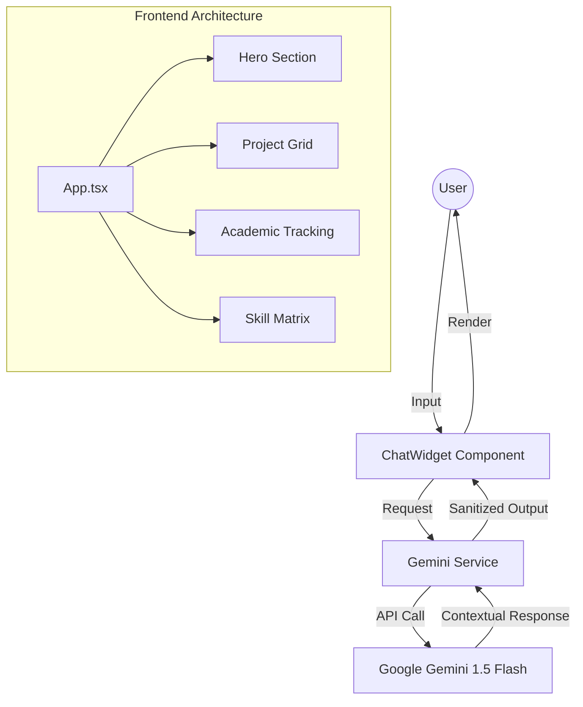

# 🏗️ Rahul S | Engineering-Focused Portfolio Blueprint

[](https://reactjs.org/)
[](https://www.typescriptlang.org/)
[](https://vitejs.dev/)
[](https://tailwindcss.com/)
[](https://deepmind.google/technologies/gemini/)
[](https://www.framer.com/motion/)

> **"I don't just build websites — I engineer solutions."**
> A premium, production-grade digital architecture showcasing the intersection of Civil Engineering logic and Full-Stack Web Development.

---

## 🎯 Problem vs. Solution

### The Problem
Traditional portfolios are often static, generic, and fail to communicate the complex "engineering mindset" required for modern technical leadership. They lack interactivity and fail to demonstrate real-time AI integration capabilities.

### The Solution
A **Neobrutalist Blueprint** interface that treats web development as a structural discipline. This project integrates:
- **Cognitive Layer**: A custom-tuned Gemini AI agent that acts as a digital twin for the developer.
- **Structural Layer**: A strict TypeScript-first architecture ensuring type safety across complex component trees.
- **Kinetic Layer**: High-performance animations via Framer Motion that guide user attention without sacrificing speed.

---

## 🧠 Intelligence & Architecture

### System Flow: AI Cognitive Loop
The application features a real-time AI interface powered by Google's Gemini 1.5 Flash model, providing instant, context-aware responses about the developer's background and projects.



### Component Blueprint
| Component | Responsibility | Technical Implementation |
| :--- | :--- | :--- |
| **Hero** | Brand Identity | Framer Motion staggered entrances |
| **ChatWidget** | AI Interaction | React State + Gemini SDK Integration |
| **Marquee** | Social Proof | CSS-optimized infinite scroll |
| **ProjectCard** | Portfolio Showcase | Dynamic data mapping from `constants.tsx` |
| **Navbar** | Navigation | Intersection Observer for active states |

---

## 🛠️ Setup & Installation

### Prerequisites
- **Node.js**: v18.0.0 or higher
- **NPM/Yarn**: Latest version
- **Gemini API Key**: Obtain from [Google AI Studio](https://aistudio.google.com/)

### Installation Steps

1. **Clone the Repository**
   ```bash
   git clone https://github.com/rahulcvwebsitehosting/portfolio-blueprint.git
   cd portfolio-blueprint
   ```

2. **Install Dependencies**
   ```bash
   npm install
   ```

3. **Configure Environment Variables**
   Create a `.env` file in the root directory:
   ```env
   API_KEY=your_gemini_api_key_here
   ```

4. **Launch Development Server**
   ```bash
   npm run dev
   ```

5. **Build for Production**
   ```bash
   npm run build
   ```

---

## 🏗️ Technical Specifications

- **Framework**: React 19 (Functional Components + Hooks)
- **Build Tool**: Vite 6 (ESM-first)
- **Type System**: TypeScript (Strict Mode)
- **Styling**: Tailwind CSS (Utility-first)
- **Animation Engine**: Framer Motion (Spring physics & Layout transitions)
- **AI Integration**: `@google/genai` (Gemini 1.5 Flash)
- **Icons**: Lucide React (SVG-based)

---

## 🤝 Connect

Designed and Engineered by **Rahul Shyam**.

[](https://linkedin.com/in/rahulshyamcivil)
[](https://github.com/rahulcvwebsitehosting)
[](https://x.com/RahulShyamCv)
[](https://www.threads.net/@RahulCvJPS)
[](mailto:rahulshyam2006@outlook.com)

---

<div align="center">
  <sub>&copy; 2024 Rahul Shyam. Built with precision and purpose.</sub>
</div>
